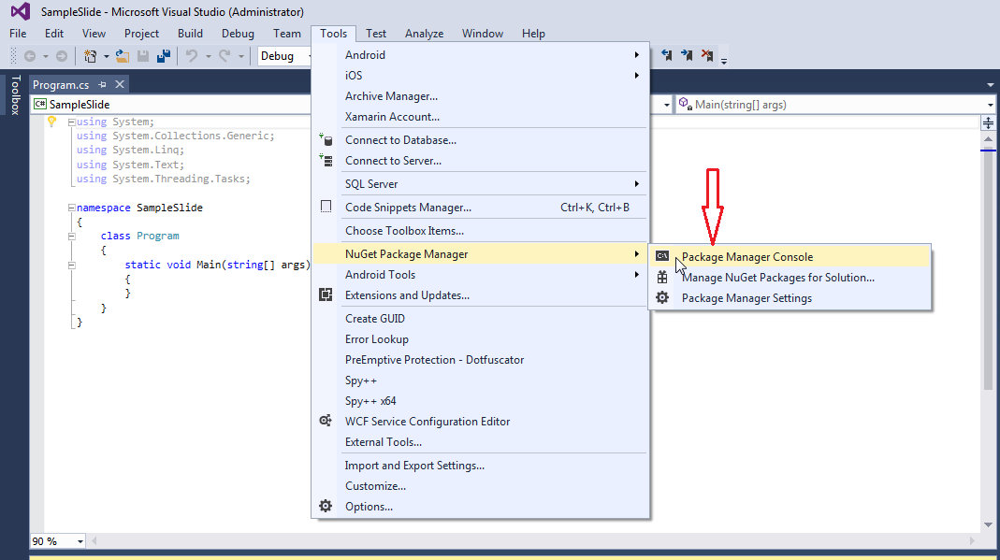

## **Installing Aspose.PUB for .NET through NuGet**
NuGet is the easiest way to download and install Aspose APIs for .NET. Open Microsoft Visual Studio and NuGet package manager. Search "aspose" to find the desired Aspose API. Click on "Install", the selected API will be downloaded and referenced in your project.

## **Install or Update Aspose.PUB using the Package Manager Console**
You can follow the steps below to reference the Aspose.PUB API using the package manager console:

1. Open your solution/project in Visual Studio.
1. Select Tools -> Library Package Manager -> Package Manager Console from the menu to open package manager console.

Type the command “**Install-Package Aspose.PUB -Version x.x.0**” and press enter to install latest full release into your application. Alternatively, you can add the "**-prerelease**" suffix to the command in order to specify that the latest release including hot fixes is to be installed as well.

If you are not familiar with the [Aspose EULA](http://www.aspose.com/corporate/purchase/end-user-license-agreement.aspx) then it is a good idea to read the license referenced in the URL. 

You should now find that Aspose.PUB has successfully been added and referenced in your application for you.

In the package manager console, you can also use the command “**Update-Package Aspose.PUB.NET**” and press enter to check for any updates to the Aspose.PUB package and install them if present. You can also add the "-prerelease" suffix to update the latest release.
## **Referencing the Component**
In order to use any component in your application, add a reference to it. The steps that follow describe what to do when you use Visual Studio .NET.

1. In the Solution Explorer, expand the project node you want to add a reference to.
1. Right-click the **References** node for the project and select **Add Reference** from the menu.
1. In the Add Reference dialog box, select the **.NET** tab (it's usually selected by default).
1. If you have used MSI installer to install Aspose.PUB, you will see Aspose.PUB in the top pane. Select it and then click the **Select** button.
1. If you have downloaded and unpacked the DLL only, click the **Browse** button and locate the Aspose.PUB.dll file. 
   You have referenced Aspose.PUB and it should appear in the **SelectedComponents** pane of the dialog box.
1. Click **OK**. 
   An Aspose.PUB reference appears under the **References** node of the project.
## **Get Assembly Build Version Information**
Once you include the API in your project, you can get the referenced API version information using the [BuildVersionInfo](https://reference.aspose.com/pub/net/aspose.pub/buildversioninfo/) class as shown in the following code sample.


## **Uninstalling Aspose.PUB for .NET**
If you have used MSI installer to deploy Aspose.PUB, follow these steps to completely remove the component and the associated demos and documentation:

1. From the **Start** menu, select **Settings** followed by **Control Panel**.
1. Click **Add/Remove Programs**.
1. Select **Aspose.PUB**.
1. Click the **Change/Remove** button to remove Aspose.PUB.
## **Targeting Specific .NET Framework Version**
Although Aspose.PUB references .NET Framework 1.1, it is possible to use it on a machine with only version 1.0 installed. But you need to add an entry to the application configuration file to redirect the references because otherwise the component will try to load assemblies from .NET Framework 1.1. Each assembly that makes up the .NET Framework must be redirected to use .NET Framework version 1.0. Configuration file is an XML file that can be changed as needed. Developers can use it to change settings without recompiling applications. The name and location of the application configuration file depend on the application's host, which can be one of the following:

- Executable--hosted application:
  The configuration file for an application hosted by the executable host is in the same directory as the application. The name of the configuration file is the name of the application with a .config extension. For example, an application called myApp.exe can be associated with a configuration file called myApp.exe.config.
- ASP.NET-hosted application:
  ASP.NET configuration files are called Web.config and placed in the application directory as well. Enter the following XML in the application configuration file:

**XML**



 <configuration>

  <startup>

    <requiredRuntime version="v1.0.3705"  />

  </startup>

  <runtime>

    <assemblyBinding xmlns="urn:schemas-microsoft-com:asm.v1" appliesTo="v1.0.3705">

      <dependentAssembly>

        <assemblyIdentity name="Regcode" publicKeyToken="b03f5f7f11d50a3a" culture=""/>

        <bindingRedirect oldVersion="0.0.0.0-65535.65535.65535.65535" newVersion="1.0.3300.0"/>

      </dependentAssembly>

      <dependentAssembly>

        <assemblyIdentity name="System.EnterpriseServices" publicKeyToken="b03f5f7f11d50a3a" culture=""/>

        <bindingRedirect oldVersion="0.0.0.0-65535.65535.65535.65535" newVersion="1.0.3300.0"/>

      </dependentAssembly>

      <dependentAssembly>

        <assemblyIdentity name="System.Security" publicKeyToken="b03f5f7f11d50a3a" culture=""/>

        <bindingRedirect oldVersion="0.0.0.0-65535.65535.65535.65535" newVersion="1.0.3300.0"/>

      </dependentAssembly>

      <dependentAssembly>

        <assemblyIdentity name="CustomMarshalers" publicKeyToken="b03f5f7f11d50a3a" culture=""/>

        <bindingRedirect oldVersion="0.0.0.0-65535.65535.65535.65535" newVersion="1.0.3300.0"/>

      </dependentAssembly>

      <dependentAssembly>

        <assemblyIdentity name="Accessibility" publicKeyToken="b03f5f7f11d50a3a" culture=""/>

        <bindingRedirect oldVersion="0.0.0.0-65535.65535.65535.65535" newVersion="1.0.3300.0"/>

      </dependentAssembly>

      <dependentAssembly>

        <assemblyIdentity name="System.Configuration.Install" publicKeyToken="b03f5f7f11d50a3a" culture=""/>

        <bindingRedirect oldVersion="0.0.0.0-65535.65535.65535.65535" newVersion="1.0.3300.0"/>

      </dependentAssembly>

      <dependentAssembly>

        <assemblyIdentity name="System.DirectoryServices" publicKeyToken="b03f5f7f11d50a3a" culture=""/>

        <bindingRedirect oldVersion="0.0.0.0-65535.65535.65535.65535" newVersion="1.0.3300.0"/>

      </dependentAssembly>

      <dependentAssembly>

        <assemblyIdentity name="System.Drawing.Design" publicKeyToken="b03f5f7f11d50a3a" culture=""/>

        <bindingRedirect oldVersion="0.0.0.0-65535.65535.65535.65535" newVersion="1.0.3300.0"/>

      </dependentAssembly>

      <dependentAssembly>

        <assemblyIdentity name="System.ServiceProcess" publicKeyToken="b03f5f7f11d50a3a" culture=""/>

        <bindingRedirect oldVersion="0.0.0.0-65535.65535.65535.65535" newVersion="1.0.3300.0"/>

      </dependentAssembly>

      <dependentAssembly>

        <assemblyIdentity name="System.Web" publicKeyToken="b03f5f7f11d50a3a" culture=""/>

        <bindingRedirect oldVersion="0.0.0.0-65535.65535.65535.65535" newVersion="1.0.3300.0"/>

      </dependentAssembly>

      <dependentAssembly>

        <assemblyIdentity name="System.Web.RegularExpressions" publicKeyToken="b03f5f7f11d50a3a" culture=""/>

        <bindingRedirect oldVersion="0.0.0.0-65535.65535.65535.65535" newVersion="1.0.3300.0"/>

      </dependentAssembly>

      <dependentAssembly>

        <assemblyIdentity name="System.Web.Services" publicKeyToken="b03f5f7f11d50a3a" culture=""/>

        <bindingRedirect oldVersion="0.0.0.0-65535.65535.65535.65535" newVersion="1.0.3300.0"/>

      </dependentAssembly>

      <dependentAssembly>

        <assemblyIdentity name="System.Windows.Forms" publicKeyToken="b77a5c561934e089" culture=""/>

        <bindingRedirect oldVersion="0.0.0.0-65535.65535.65535.65535" newVersion="1.0.3300.0"/>

      </dependentAssembly>

      <dependentAssembly>

        <assemblyIdentity name="System.Xml" publicKeyToken="b77a5c561934e089" culture=""/>

        <bindingRedirect oldVersion="0.0.0.0-65535.65535.65535.65535" newVersion="1.0.3300.0"/>

      </dependentAssembly>

      <dependentAssembly>

        <assemblyIdentity name="System.Data" publicKeyToken="b77a5c561934e089" culture=""/>

        <bindingRedirect oldVersion="0.0.0.0-65535.65535.65535.65535" newVersion="1.0.3300.0"/>

      </dependentAssembly>

      <dependentAssembly>

        <assemblyIdentity name="System.Design" publicKeyToken="b03f5f7f11d50a3a" culture=""/>

        <bindingRedirect oldVersion="0.0.0.0-65535.65535.65535.65535" newVersion="1.0.3300.0"/>

      </dependentAssembly>

      <dependentAssembly>

        <assemblyIdentity name="System.Drawing" publicKeyToken="b03f5f7f11d50a3a" culture=""/>

        <bindingRedirect oldVersion="0.0.0.0-65535.65535.65535.65535" newVersion="1.0.3300.0"/>

      </dependentAssembly>

      <dependentAssembly>

        <assemblyIdentity name="System" publicKeyToken="b77a5c561934e089" culture=""/>

        <bindingRedirect oldVersion="0.0.0.0-65535.65535.65535.65535" newVersion="1.0.3300.0"/>

      </dependentAssembly>

      <dependentAssembly>

        <assemblyIdentity name="System.Messaging" publicKeyToken="b03f5f7f11d50a3a" culture=""/>

        <bindingRedirect oldVersion="0.0.0.0-65535.65535.65535.65535" newVersion="1.0.3300.0"/>

      </dependentAssembly>

      <dependentAssembly>

        <assemblyIdentity name="IEExecRemote" publicKeyToken="b03f5f7f11d50a3a" culture=""/>

        <bindingRedirect oldVersion="0.0.0.0-65535.65535.65535.65535" newVersion="1.0.3300.0"/>

      </dependentAssembly>

      <dependentAssembly>

        <assemblyIdentity name="IEHost" publicKeyToken="b03f5f7f11d50a3a" culture=""/>

        <bindingRedirect oldVersion="0.0.0.0-65535.65535.65535.65535" newVersion="1.0.3300.0"/>

      </dependentAssembly>

      <dependentAssembly>

        <assemblyIdentity name="IIEHost" publicKeyToken="b03f5f7f11d50a3a" culture=""/>

        <bindingRedirect oldVersion="0.0.0.0-65535.65535.65535.65535" newVersion="1.0.3300.0"/>

      </dependentAssembly>

      <dependentAssembly>

        <assemblyIdentity name="ISymWrapper" publicKeyToken="b03f5f7f11d50a3a" culture=""/>

        <bindingRedirect oldVersion="0.0.0.0-65535.65535.65535.65535" newVersion="1.0.3300.0"/>

      </dependentAssembly>

      <dependentAssembly>

        <assemblyIdentity name="mscorcfg" publicKeyToken="b03f5f7f11d50a3a" culture=""/>

        <bindingRedirect oldVersion="0.0.0.0-65535.65535.65535.65535" newVersion="1.0.3300.0"/>

      </dependentAssembly>

      <dependentAssembly>

        <assemblyIdentity name="System.Management" publicKeyToken="b03f5f7f11d50a3a" culture=""/>

        <bindingRedirect oldVersion="0.0.0.0-65535.65535.65535.65535" newVersion="1.0.3300.0"/>

      </dependentAssembly>

      <dependentAssembly>

        <assemblyIdentity name="System.Runtime.Remoting" publicKeyToken="b77a5c561934e089" culture=""/>

        <bindingRedirect oldVersion="0.0.0.0-65535.65535.65535.65535" newVersion="1.0.3300.0"/>

      </dependentAssembly>

      <dependentAssembly>

        <assemblyIdentity name="System.Runtime.Serialization.Formatters.Soap" publicKeyToken="b03f5f7f11d50a3a" culture=""/>

        <bindingRedirect oldVersion="0.0.0.0-65535.65535.65535.65535" newVersion="1.0.3300.0"/>

      </dependentAssembly>

      <dependentAssembly>

        <assemblyIdentity name="System.Web.Mobile" publicKeyToken="b03f5f7f11d50a3a" culture=""/>

        <bindingRedirect oldVersion="0.0.0.0-65535.65535.65535.65535" newVersion="1.0.3300.0"/>

      </dependentAssembly>

      <dependentAssembly>

        <assemblyIdentity name="Microsoft.Vsa.Vb.CodeDOMProcessor" publicKeyToken="b03f5f7f11d50a3a" culture=""/>

        <bindingRedirect oldVersion="0.0.0.0-65535.65535.65535.65535" newVersion="7.0.3300.0"/>

      </dependentAssembly>

      <dependentAssembly>

        <assemblyIdentity name="Microsoft_VsaVb" publicKeyToken="b03f5f7f11d50a3a" culture=""/>

        <bindingRedirect oldVersion="0.0.0.0-65535.65535.65535.65535" newVersion="7.0.3300.0"/>

      </dependentAssembly>

      <dependentAssembly>

        <assemblyIdentity name="Microsoft.Vsa" publicKeyToken="b03f5f7f11d50a3a" culture=""/>

        <bindingRedirect oldVersion="0.0.0.0-65535.65535.65535.65535" newVersion="7.0.3300.0"/>

      </dependentAssembly>

      <dependentAssembly>

        <assemblyIdentity name="Microsoft.VisualBasic.Vsa" publicKeyToken="b03f5f7f11d50a3a" culture=""/>

        <bindingRedirect oldVersion="0.0.0.0-65535.65535.65535.65535" newVersion="7.0.3300.0"/>

      </dependentAssembly>

      <dependentAssembly>

        <assemblyIdentity name="cscompmgd" publicKeyToken="b03f5f7f11d50a3a" culture=""/>

        <bindingRedirect oldVersion="0.0.0.0-65535.65535.65535.65535" newVersion="7.0.3300.0"/>

      </dependentAssembly>

      <dependentAssembly>

        <assemblyIdentity name="Microsoft.JScript" publicKeyToken="b03f5f7f11d50a3a" culture=""/>

        <bindingRedirect oldVersion="0.0.0.0-65535.65535.65535.65535" newVersion="7.0.3300.0"/>

      </dependentAssembly>

      <dependentAssembly>

        <assemblyIdentity name="Microsoft.VisualBasic" publicKeyToken="b03f5f7f11d50a3a" culture=""/>

        <bindingRedirect oldVersion="0.0.0.0-65535.65535.65535.65535" newVersion="7.0.3300.0"/>

      </dependentAssembly>

      <dependentAssembly>

        <assemblyIdentity name="Microsoft.VisualC" publicKeyToken="b03f5f7f11d50a3a" culture=""/>

        <bindingRedirect oldVersion="0.0.0.0-65535.65535.65535.65535" newVersion="7.0.3300.0"/>

      </dependentAssembly>

    </assemblyBinding>

  </runtime>

</configuration>



For more information see [MSDN article](http://msdn.microsoft.com/library/default.asp?url/library/en-us/cpguide/html/cpcontargetingnetframeworkversion.asp)
