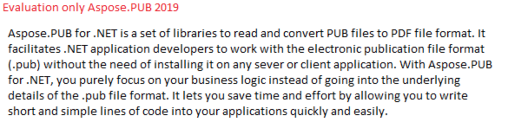

## **Evaluate Aspose.PUB**
You can download Aspose.PUB for .NET free of cost for evaluation. The evaluation version provides almost all functionality of the product with certain limitations. The same evaluation version becomes licensed when you purchase a license and add a couple of lines of code to [apply the license](https://docs.aspose.com/pub/net/licensing/#applying-for-a-license).

If you want to test Aspose.PUB without evaluation version limitations, you can also request a 30 Day Temporary License. Please refer to [How to get a Temporary License?](https://purchase.aspose.com/temporary-license)
### **Evaluation Version Limitations**
The evaluation version of Aspose.PUB (without a license specified) provides full product functionality except that an evaluation version warning is displayed at the top of the converted document as shown in the following image.

## **Applying for a License**
You can easily download an evaluation version of Aspose.PUB from its [download page](https://www.nuget.org/packages/Aspose.Pub/). The evaluation version provides absolutely the same capabilities as the licensed version of Aspose.PUB. Furthermore, the evaluation version simply becomes licensed when you purchase a license and add a couple of lines of code to apply the license.
### **About the License**
The license is a plain-text XML file that contains details such as the product name, number of developers it is licensed to, subscription expiry date and so on. The file is digitally signed, so don't modify the file. Even inadvertent addition of an extra line break into the file will invalidate it.

You need to set a license before utilizing Aspose.PUB if you want to avoid its evaluation limitations. It is only required to set a license once per application (or process).
## **Setting a License in Aspose.PUB for .NET**
In Aspose.PUB, a license can be loaded from a file, stream or an embedded resource.Aspose.PUB tries to find the license in the following locations:

- Explicit path
- The folder that contains the DLL of the component (included in Aspose.PUB)
- The folder that contains the assembly that called the DLL of the component (included in Aspose.PUB)
- The folder that contains the entry assembly (your .exe)
- An embedded resource in the assembly that called the DLL of the component (included in Aspose.PUB) There are two common methods to set the license, which are discussed below:
### **Apply License using File**
The easiest way to set a license, is to put the license file in the same folder as that of the DLL of the component (included in Aspose.PUB) and specify just the file name without its path.


### **Apply LIcense from Stream Object**


When you call SetLicense method, the license name should be the same as that of your license file name. For example, you may change the license file name to "Aspose.PUB.lic.xml". Then in your code, you should use the modified license name (that is Aspose.Pub.lic.xml) for the SetLicense method.
### **Including the License File as an Embedded Resource**
Another neat way of packaging the license with your application and making sure it will not be lost, is to include it as an embedded resource into one of the assemblies that calls the dll of the component (included in Aspose.PUB). To include the license file as an embedded resource, perform the following steps:

- In Visual Studio .NET, include the license (.lic) file into the project using the File | Add Existing Item... menu
- Select the file in the Solution Explorer and set Build Action to Embedded Resource in the Properties window
- To access the license embedded in the assembly (as an embedded resource), it is not needed to call GetExecutingAssembly and GetManifestResourceStream methods of System.Reflection.Assembly class of Microsoft .NET Framework. All is needed to do, is to just add the license file as an embedded resource to your project and pass the name of the license file into SetLicense License method. The License class will automatically find the license file in the embedded resources.

Please review the example given below to understand this method of setting license (embedded) in your applications.



 // Instantiate the License class

Aspose.PUB.License license = new Aspose.PUB.License();

// Pass only the name of the license file embedded in the assembly

license.SetLicense("Aspose.PUB.lic");


## **Apply Metered License**
Aspose.PUB allows developers to apply metered key. It is a new licensing mechanism. The new licensing mechanism will be used along with the existing licensing method. Those customers who want to be billed based on the usage of the API features can use the metered licensing. For more details, please refer to [Metered Licensing FAQ](https://purchase.aspose.com/faqs/licensing/metered) section.

A new class Metered has been introduced to apply metered key. Following is the sample code demonstrating how to set metered public and private keys.


