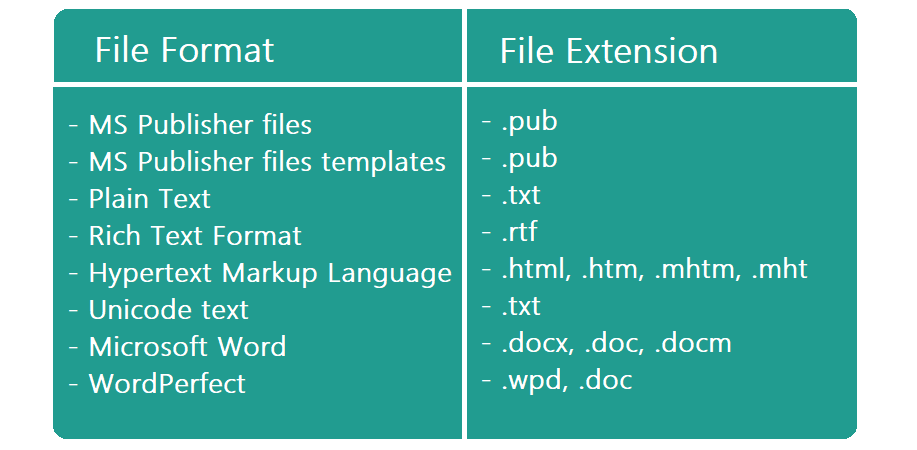
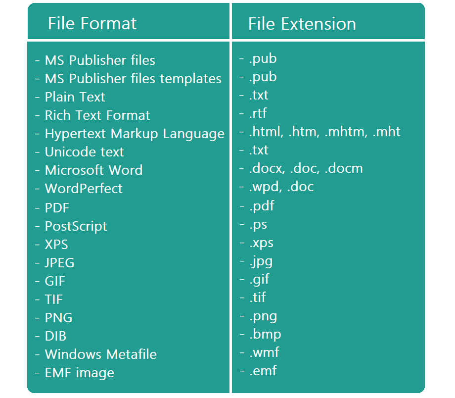
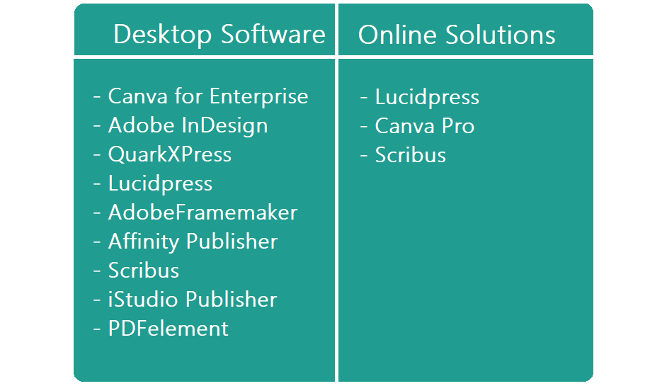
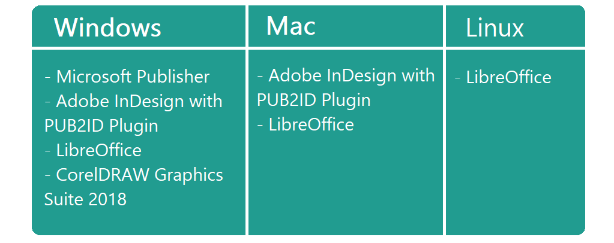

# What is MS Publisher?

MS Publisher is a member of the MS Office package. It is a simple, basic tool to manage page markup.
The program has only desktop versions. It is accessible separately or with the Office 365 subscription.

## The Usage of MS Publisher.

As follows from the name of the app, it is mainly used for publishing. With it, you can easily create different typography and marketing materials and things like business, birthday and postcards, brochures and booklets, flyers and ads, or even project a book cover. 
You can easily layout and style text boxes, images, and calendars. The appearance of your document will not change and look the way you designed it when printing, publishing, or sending it.

## Advantages of the program.

So to find out if this software is something that can cover your needs let’s see its pros along with the cons:

| **Pros** | **Cons** |
| :- | :- |
| Easy-to-use. For those who have ever worked with any MS Office program, this one is intuitively understandable. |  Does not have an online version. |
| Compatibility with other Office products. It is easy to transfer data from any of them to your `.pub` document. | File with the `.pub` extension can be opened only by the MS Publisher and few other programs so sometimes it should be converted to a more well-spread format. |
| The process of adding content is really simple. | The software does not allow adding audio or video content so it does not fit website design |
| Various user tutorials(wizards) within the software. | The software is not that well compatible with Adobe. |
| A big scale of build-in categorized and organized templates. Using them will save your time and make your result files look neater and more professional. | Templates do not allow changing the formatting. They are not a good choice if you want to have a unique brand-new design. |
| Opportunity to customize for individual mail receivers the marketing materials. | Adding images increases notably `.pub` file size that causes loading time extension. |
| Grammar correction and spellcheck included. | Spelling and grammar functionality is limited to the size of the standard language dictionary. |
| Allows sending the project you work on as a PDF or XPS file, so the content will not lose its quality.| Text boxes are not automatically scalable, so when one is too small for the text you want to put in, you should change the size or create the other box, linked to this one.|
| Sharing access is possible. | Shared access requires OneDrive, OneDrive for Business, or SharePoint.|
| CMYK-optimized printing is supported. | Inserted tables are saved as images. |

## Supported file formats. 

The program can open and save to the next file formats.

### Formats supported by Publisher to open:

### Formats supported by Publisher to save as:

## What is a .pub file?

PUB file is a document created with the means of MS Publisher. It can be a ready-to-use one with all the text, image, and other content arranged or just a template that the user is able to use to create publishing production with the fixed formatting. Both kinds of files have a `.pub` extension.
The format is known for bad portability along with its incapability to be opened by most software, even ones from the MS Office package.

## Publisher like programs

There are a few reasons why you would like to find an alternative to MS Publisher, they were previously mentioned and they are:
- The app does not have an online version.
- It works only on Windows.
- PUB format is not very popular because of its lack of portability.

The image gives you some examples of desktop and online MS Publisher analogs.

## Publisher vs PowerPoint. 

The two programs are the members of the MS Office package so it may occur a question which program is better. 

When they both allow users to work with text, images, and data content, both have Android, iOS, and Desktop versions but they serve different purposes and have different features to meet their objectives.

MS PowerPoint is a solution for creating presentations of different complexity. It has features like animations and sounds, presentation notes, pre-recorded narration, presentation templates, etc. You can still use the application to create some printout production, like brochures, but it would be much harder without the tools MS Publisher has for such a task.

On the other hand, MS Publisher may be used for creating presentations too, but as was mentioned above this software does not allow including video and audio materials directly, only by adding the link to these materials.

## How do I open the .pub extension?

By now files with `.pub` extension can be opened by little software, apart from MS Publisher itself. These apps are not mostly free.
Let's have a look at the most popular ones:

### How can I open a Publisher file without the program?

If you have got a file with the `.pub` extension and using any of the aforementioned programs is not the case, you have a few options:

- You can convert the document to a format you have software to work with. There are a lot of converter applications that may help you, like free, online [Converter](https://products.aspose.app/pub/conversion/pub) from Aspose.

- The other way is to open your file to view. For this, there is another type of application, - [Viewer](https://products.aspose.app/pub/viewer) is present. With it, you will see the content of the file instantly.

## Conclusion.

MS Publisher is a pretty cheap in comparison to its competitor's program for creating publishing materials. The app is intuitively easy-to-use for those who have ever worked with any MS Office software and gives has many features to make the process of creating, emailing the result, and publishing smooth. The main its drawback though is that the `.pub` format is low compatible.

