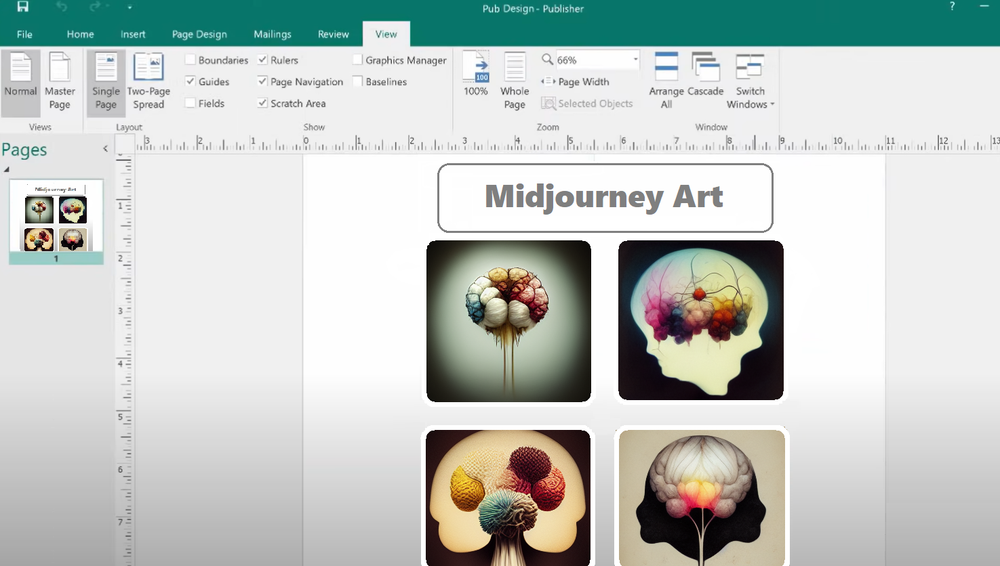
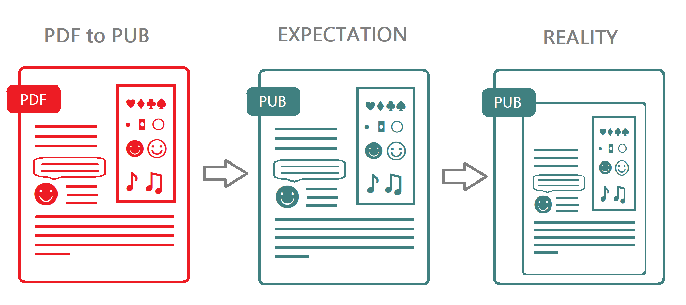
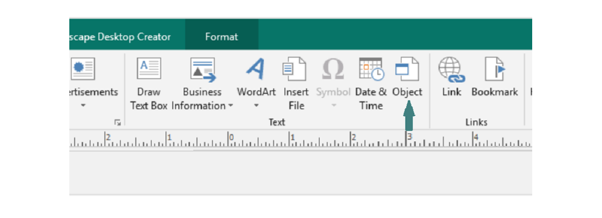

# PDF to PUB conversion, why not?

## Introduction

When PUB to PDF does not give you any trouble to convert, with the great variety of apps, and integrated into MS Publisher functionality to save your file as PDF the back conversion seems to be not that easy to do.

Yes there are a significant number of free converters on the web. They offer quick functionality to transform almost any desired file to another format. As for PDF to PUB conversion you may have lost the count of pages you had already visited with no result. Either there are no converters or the functionality does not actually provide you with such transformation and offers you another conversion. So here goes a question: why is such a popular search request left uncovered?

## Comparison of PDF and PUB files

To answer the question we need to first understand the peculiarities of each format, its structure, and its purposes.

As we learned from the Introduction to [*MS Publisher article*](https://docs.aspose.com/pub/net/introduction-to-ms-publisher/), the PUB file is a document created with the means of MS Publisher. It can be a ready-to-use one with all the text, image, and other content arranged or just a template that the user is able to use to create publishing production with the fixed formatting. 

PUB file is a layout document, developed mostly for design purposes. Each object of the document is kinda individual and can be moved, replaced, or scaled (when opened in MS Publisher of course).

On the contrary, [*PDF*](https://docs.aspose.com/page/net/what-is-pdf-file/) is a static [*Page Description Language*](https://docs.aspose.com/page/net/page-description-languages/) that has a strict unchangeable structure. 

### Differences in structure of documents

The different structure of these formats goes mostly from the purpose they are used for.

Here is the [*structure of PDF file*](https://docs.aspose.com/page/net/what-is-pdf-file/#pdf-file-structure). In short it has:
- Header that contains the version of the PDF.
- Body that contains objects of the document.
- Cross-reference table to have quick access to the document’s objects.
- Trailer, points to the last cross-reference table and contains a common quantity of objects in cross-reference tables.

The Publisher document does not really have a structure. It is like a canvas where you place the objects of type, size, and color you need where you need them. There are so many variations on arranging your file that the program included a ton of templates so you could create your print-out production quickly.

The different structure of these formats goes mostly from the purpose they are used for. When PDF is mostly to create Structured text files, PUB is aimed to make it easier to create designed production. That is why the interface is more interactive where you can just drag any object you want, and customize it. So the PUB file's structure is just a page layout and design objects.

Because of these differences, the conversion is not presented anywhere as it would be of no use.  I am not saying that it is not possible to develop such a converter that will extract the same content and transfer it to the final file, but this will require a considerable amount of time to produce. PUB file is closed and there is too little information so developers could reproduce such files. 
If someone creates a simple app just to cover the search request, if describing such a transformation with a picture it would look somehow like this.

## How can you get the content of a PDF to PUB file?

If there is no conversion, what to do? Here are a few ways you can get the texts, images, tables from PDF files to MS Publisher.

### PDF to PUB through the midway conversion to another format.

As we have just found out that there is no use in PDF to PUB conversion, you still may want to have the content of your PDF file while working in MS Publisher. Here are the steps you need to take:
- Indicate the type of content you need to transfer. Is it text, image, or table?
- Find the converters appropriate for the output format and convert the files. Here are all options you may need when [*convert PDF file*](https://products.aspose.app/pdf/conversion).
- Copy and paste the content of the converted file to your Pub file.

### Inserting PDF file to the page layout in MS Publisher.

You may also open your PDF file right from MS Publisher:
- Create or open a publication.
- At the desired place on your page layout to add the content.
- Click the Insert and then the Object button.

- Choose the Create from file option and search your PDF file to add it to the document. Selected PDF file will be added into the PUB document as an OLE object and can be modified by PDF editors inside MS Publisher.

### PrintScreen the content and Paste.

Another way is kinda amateur. It only works when your PUB file does not require high quality.
- Take a print screen of the area of the PDF file you want to transfer.
- Paste it to the PUB file.
- Crop the screen if needed.

